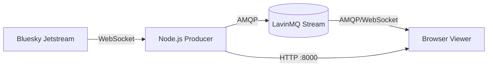

# Bluesky Streams

A demo of [LavinMQ](https://lavinmq.com) **stream filtering**. A Node.js producer subscribes to the [Bluesky Jetstream](https://github.com/bluesky-social/jetstream) firehose, tags each message with AMQP headers, and publishes it to a LavinMQ stream queue. A browser viewer connects directly to LavinMQ over WebSocket and uses `x-stream-filter` to subscribe only to messages matching the chosen type and language.

- LavinMQ streams: <https://lavinmq.com/documentation/streams>
- Bluesky Jetstream: <https://github.com/bluesky-social/jetstream>

## Architecture


```mermaid
graph LR
    Bluesky[Bluesky Jetstream] -->|WebSocket| Producer[Node.js Producer]
    Producer -->|AMQP| LavinMQ[(LavinMQ Stream)]
    LavinMQ -->|AMQP/WebSocket| Viewer[Browser Viewer]
    Producer -->|HTTP :8000| Viewer
```

## Quick start

```bash
docker compose up
```

Then open <http://localhost:8000> and click **Start Stream**.

`docker compose up` brings up LavinMQ (AMQP on 5672, WebSocket on 15672) and the producer (HTTP viewer on 8000). The producer ingests Jetstream and publishes to the `bluesky-stream` queue; the viewer connects to LavinMQ directly and applies stream filters.

## Running without Docker

```bash
npm install
AMQP_URL=amqp://localhost:5672 npm start
```

Requires LavinMQ running locally with AMQP on 5672 and WebSocket on 15672.

## Configuration

| Variable      | Default                  | Purpose             |
|---------------|--------------------------|---------------------|
| `AMQP_URL`    | `amqp://localhost:5672`  | LavinMQ connection  |
| `STREAM_NAME` | `bluesky-stream`         | Stream queue name   |
| `HTTP_PORT`   | `8000`                   | Viewer HTTP port    |

## Retention

Disk usage is bounded by a LavinMQ **policy** (`bluesky-retention`) that sets `max-length-bytes=500000000` (500 MB) on any queue matching `^bluesky-stream$`. The policy is applied by the `policy-init` service in `docker-compose.yml` via `lavinmqctl set_policy`. Tune the value there, or apply your own policy if running LavinMQ outside compose:

```bash
lavinmqctl set_policy bluesky-retention "^bluesky-stream$" \
  '{"max-length-bytes":500000000}' --apply-to=queues
```

## How filtering works

The producer attaches headers to every message:

| Header          | Example       | Meaning                        |
|-----------------|---------------|--------------------------------|
| `bs.type`       | `post`        | Activity kind (post/like/...)  |
| `bs.lang`       | `en`          | First language tag of a post   |
| `bs.has_media`  | `true`        | Set when the post has an embed |
| `bs.date`       | `2026-05-05`  | UTC date of the event          |

The viewer subscribes with `x-stream-filter` arguments matching these headers. LavinMQ only delivers messages whose headers match — see `index.html` for the subscribe call and `index.js` for the publish side.
